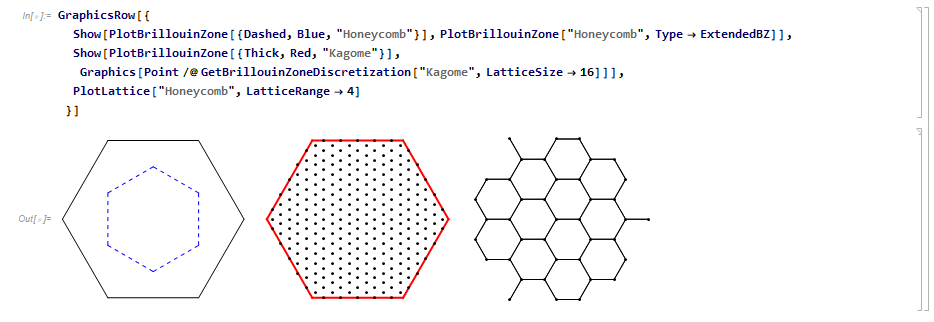
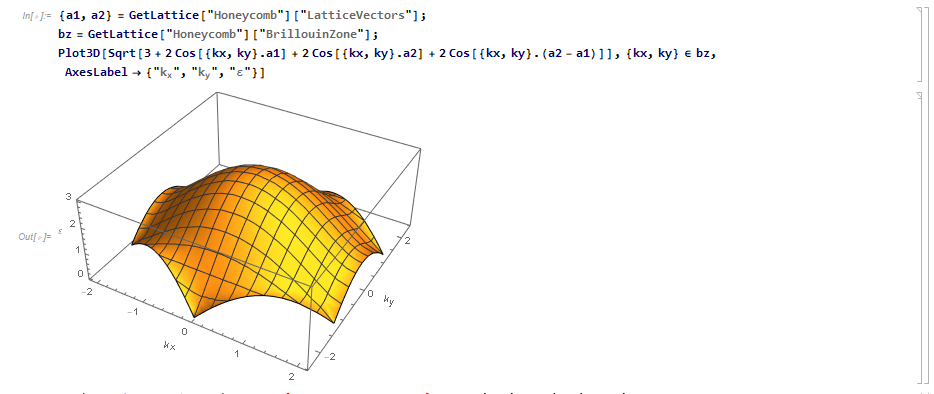
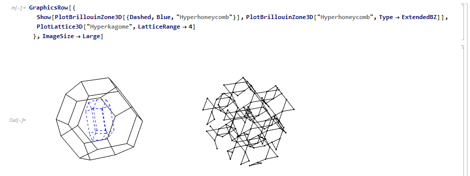

# PhysicsLattice

The package PhysicsLattice.m is a Wolfram Mathematica Package providing definitions of lattice graphs which are common in condensed matter physics. 
The library includes the definition of the lattices itself (underlying Bravais lattice and basis), Brillouin zone definitions (first BZ and extended BZ) and discretization tools, as well plotting tools. 

## Examples
Plotting of two-dimensional Brillouin zones, discretization of Brillouin zones, and plotting of lattices. 



Dispersion relation of Graphene, plotted within the first Brillouin zone of the honeycomb lattice.



Plotting of three-dimensional Brillouin zones and lattices. 



## Installation

To install the package, you may either download the package file `src/PhysicsLattice.m` and manually place it in a directory that is included in your Mathematica search path, or you can do so by executing the following Mathematica command: 
```
URLDownload[
    "https://raw.githubusercontent.com/fbuessen/PhysicsLattice/main/src/PhysicsLattice.m", 
    FileNameJoin[{$UserBaseDirectory, "Applications", "PhysicsLattice.m"}]
]
```
The above command will save the file in the location `$UserBaseDirectory/Applications/PhysicsLattice.m`. 

Once the package has been downloaded, it can be activated with the Mathematica command
```
<< PhysicsLattice`
```

## Supported lattices

Currently, the following lattices are included.

Two-dimensional lattices:
- Square lattice
- Triangular lattice
- Honeycomb lattice
- Kagome lattice

Three-dimensional lattices:
- Cubic lattice
- Diamond lattice
- Fcc lattice
- Hyperkagome lattice
- Pyrochlore lattice
- Hyperhoneycomb lattice
- Hyperoctagon lattice

## Library functions
- GetLattice
- GetBrillouinZone
- GetBrillouinZoneDiscretization
- GetBrillouinZoneDiscretization3D
- PlotLattice
- PlotLattice3D
- PlotBrillouinZone
- PlotBrillouinZone3D

### GetLattice
GetLattice[LatticeIdentifier] returns information about the specified lattice.

LatticeIdentifier is the String-form name of the lattice, e.g. one of {Square, Triangular, Honeycomb, Kagome, Cubic, Diamond, Fcc, Hyperkagome, Pyrochlore, Hyperhoneycomb, Hyperoctagon}.

Possible options:
- LatticeConstant->Float (default: 1.0. Defined as nearest-neighbor distance)

### GetBrillouinZone
GetBrillouinZone[LatticeIdentifier] returns the Brillouin zone parametrized as a BoundaryMeshRegion. 

LatticeIdentifier the String-form name of the lattice, see GetLattice[].

Possible options:
- Type->[FirstBZ|ExtendedBZ] (default: FirstBZ)
- Options of GetLattice[]

### GetBrillouinZoneDiscretization
GetBrillouinZoneDiscretization[LatticeIdentifier] returns a discretization of the given two-dimensional BZ.

LatticeIdentifier the String-form name of the lattice, see GetLattice[].

Possible options:
- LatticeSize->Int (default: 16. Number of unit cells in all directions assumed for periodic boundary conditions)
- ClippingStyle->[Automatic|None] (default:Automatic. Choosing Automatic clips the parametrization to the Brillouin zone. Choosing None clips the parametrization to a rectangular bounding box around the Brillouin zone.)
- MaxRecursion->Int (default: 4. Maximum number of recursions to build up the discretization)
- Options of GetBrillouinZone[]

### GetBrillouinZoneDiscretization3D
GetBrillouinZoneDiscretization3D[LatticeIdentifier] returns a discretization of the given three-dimensional BZ.

LatticeIdentifier the String-form name of the lattice, see GetLattice[].

Possible options:
- LatticeSize->Int (default: 16. Number of unit cells in all directions assumed for periodic boundary conditions)
- ClippingStyle->[Automatic|None] (default:Automatic. Choosing Automatic clips the parametrization to the Brillouin zone. Choosing None clips the parametrization to a rectangular bounding box around the Brillouin zone.)
- MaxRecursion->Int (default: 4. Maximum number of recursions to build up the discretization)
- Options of GetBrillouinZone[]

### PlotLattice
PlotLattice[LatticeIdentifier] plots a given two-dimensional lattice.

LatticeIdentifier can either be the String-form name of the lattice, see GetLattice[], or a list {Directive[],LatticeIdentifier} of directives and the String-form name of the lattice.

Possible options:
- LatticeRange->Float (default:4. Maximum distance of drawn sites from the origin)
- MaxRecursion->Int (default: 4. Maximum number of recursions to build up the discretization)
- Options of GetLattice[]
- Options of Graphics[]

### PlotLattice3D
PlotLattice3D[LatticeIdentifier] plots a given two-dimensional lattice.

LatticeIdentifier can either be the String-form name of the lattice, see GetLattice[], or a list {Directive[],LatticeIdentifier} of directives and the String-form name of the lattice.

Possible options:
- LatticeRange->Float (default:4. Maximum distance of drawn sites from the origin)
- MaxRecursion->Int (default: 4. Maximum number of recursions to build up the discretization)
- Options of GetLattice[]
- Options of Graphics3D[]

### PlotBrillouinZone
PlotBrillouinZone[LatticeIdentifier] plots the Brillouin zone of a given two-dimensional lattice.

LatticeIdentifier can either be the String-form name of the lattice, see GetLattice[], or a list {Directive[],LatticeIdentifier} of directives and the String-form name of the lattice.

Possible options:
- Options of GetBrillouinZone[]
- Options of Graphics[]

### PlotBrillouinZone3D
PlotBrillouinZone3D[LatticeIdentifier] plots the Brillouin zone of a given three-dimensional lattice.

LatticeIdentifier can either be the String-form name of the lattice, see GetLattice[], or a list {Directive[],LatticeIdentifier} of directives and the String-form name of the lattice.

Possible options:
- Options of GetBrillouinZone[]
- Options of Graphics3D[]